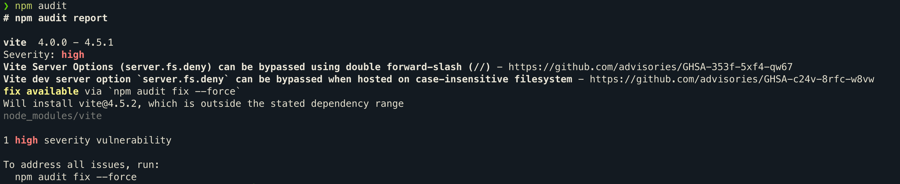
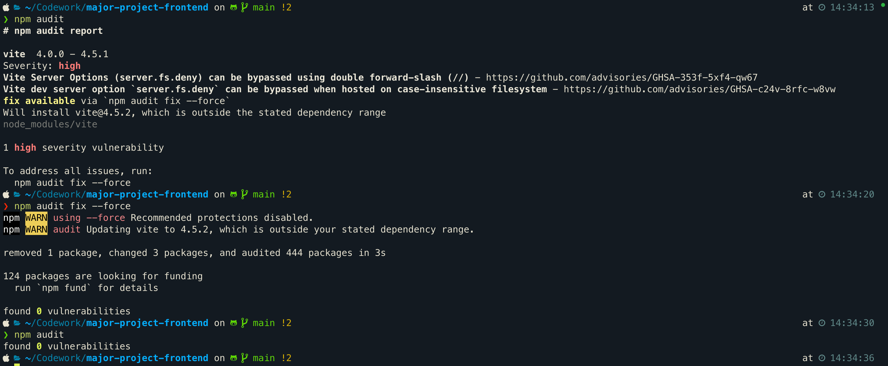

If you're working with front-end frameworks like React.js, Angular, or Vue.js, or if your project relies on a `package.json` file, you might encounter vulnerabilities when running `npm audit` or `yarn audit`. These vulnerabilities pose a security risk and need to be addressed promptly. This article will guide you through resolving vulnerabilities, particularly in React.js-based projects.

<!-- truncate -->

## Understanding Vulnerabilities

Vulnerabilities refer to flaws or weaknesses in a software system that attackers can exploit to undermine the system's integrity, availability, or confidentiality. These can emerge from outdated packages, insecure configurations, or flawed code.

## Resolving Vulnerabilities in Direct Dependencies

Direct dependencies (or devDependencies) are the packages that your project directly relies on. Here’s how you can address vulnerabilities in your React.js, Angular, or Vue.js applications:

1. **Identify Vulnerabilities:** Execute `npm audit` or `yarn audit` to uncover any vulnerabilities within your project.

2. **Assess Breaking Changes:** Before updating any packages, verify whether there are breaking changes in the newer versions. Review the release notes of the packages or use `npm outdated` or `yarn outdated` to identify any significant changes that could impact your application.

3. **Update Packages:** After evaluating for breaking changes, rectify the vulnerabilities by executing `npm audit fix` or `yarn audit fix`. This will typically upgrade the packages to the latest versions, thereby resolving the security issues. If you want to update a specific package, you can use `npm install package-name@latest` or `yarn add package-name@latest`. **Note:** Avoid using `npm audit fix --force` or `yarn audit fix --force` as it can sometimes lead to downgrading packages, which might introduce new vulnerabilities. In such cases, it's better to manually update the packages by specifying the version in the `package.json` file.

4. **Automate Security Checks:** Incorporate vulnerability checks into your CI/CD pipeline by using `npm audit` or `yarn audit` and configure the pipeline to fail if vulnerabilities are detected. Additionally, tools like `npm audit fix` or `yarn audit fix` can be employed to automatically correct vulnerabilities, streamlining the maintenance of your project's security.

|  |
| ----------------------------------------- |

|  |
| --------------------------------------------------------------------------- |

## Resolving Vulnerabilities in Indirect Dependencies

Vulnerabilities can also occur in indirect (or transitive) dependencies, which are packages that your direct dependencies require. These vulnerabilities need careful handling to avoid breaking your project. Here’s how to deal with vulnerabilities in indirect dependencies effectively:

1. **Identify Indirect Vulnerabilities:** Run `npm audit` or `yarn audit`. These commands help in identifying both direct and indirect dependency vulnerabilities.

2. **Analyze the Dependency Tree:** Use `npm ls <package_name>` or `yarn list --pattern <package_name>` to understand the dependency chain. This helps in pinpointing which direct dependencies are causing the indirect vulnerabilities.

3. **Update Direct Dependencies:** Often, updating your project's direct dependencies can also update the indirect ones, resolving vulnerabilities. Follow the general update procedures as outlined in previous sections.

4. **Manual Updates for Indirect Dependencies:** If direct updates don't resolve the issues, you can manually update indirect dependencies in `Node.js v16.14.2 or later` and `npm v8.3.0 or later`. Add `overrides` field in your `package.json`:

   ```json
   {
     "overrides": {
       "semver": "6.3.1"
     }
   }
   ```

   After specifying the override, run `npm install` or `yarn install`. This modification forces all uses of the semver package to the specified version, potentially resolving the vulnerabilities. However, ensure compatibility as this may lead to issues if the updated version is incompatible with other dependencies.

5. **Specifying Overrides for Specific Packages:** If you need to target a specific package for the update, you might add a more targeted override in your `package.json`:

   ```json
   {
     "overrides": {
       "@vitejs/plugin-react": {
         "semver": "6.3.1"
       }
     }
   }
   ```

   This ensures that only `@vitejs/plugin-react` uses the specified version of `semver`. Implement this, then run `npm install` or `yarn install` to apply the changes.

6. **CI/CD Integration:** Even if your CI/CD pipeline operates under `Node.js version 14`, you can address vulnerabilities in indirect dependencies by leveraging the `overrides` feature. First, ensure that you have `Node.js version ^16.14.0` locally. Then, add the necessary overrides to your `package.json` and run `npm install`. This process should generate an updated `package-lock.json` file reflecting the changes.
   In your CI/CD pipeline, utilize the `package-lock.json` file from your local development environment to install dependencies. Execute the following command:

```sh
npm ci
```

This specific command ensures that your project installs dependencies exactly as defined in your `package-lock.json`, applying the overrides as intended and maintaining consistency across environments.

|  |
| ----------------------------------------------------- |

|  |
| -------------------------------------------------------------- |

**It's crucial to thoroughly test your application after making these changes to ensure everything works correctly and the vulnerabilities are resolved.**

## Best Practices for Security Maintenance

Enhance the security of your front-end applications with these straightforward practices:

1. **Update Packages Regularly:** Always use the latest versions of your packages to benefit from recent security updates. Consistent updates prevent compatibility issues and reduce security risks.

2. **Automate Security:** Implement automated security scans within your CI/CD pipeline. Early detection of vulnerabilities helps in their quick resolution, keeping your production environment secure.

3. **Utilize Security Tools:** Employ tools like `npm audit` or `yarn audit` to find and address vulnerabilities. Tools such as [`snyk`](https://snyk.io/) or `npm audit fix` can help automate the fixing process.

4. **Specify Exact Versions:** When adding packages, use the `--save-exact` flag with `npm install` or `yarn add` to **lock** the versions. This prevents unintended updates and maintains consistency, reducing the likelihood of introducing vulnerabilities.

## Conclusion

Vulnerabilities in front-end applications represent considerable security threats. However, by adhering to the guidelines provided in this article, you can effectively mitigate these risks in your React.js, Angular, or Vue.js projects. Regular updates to your packages and the integration of automated security checks into your CI/CD processes are crucial steps in preserving the security and integrity of your applications. Stay proactive in your security practices to ensure a safer web environment for all users.

---
