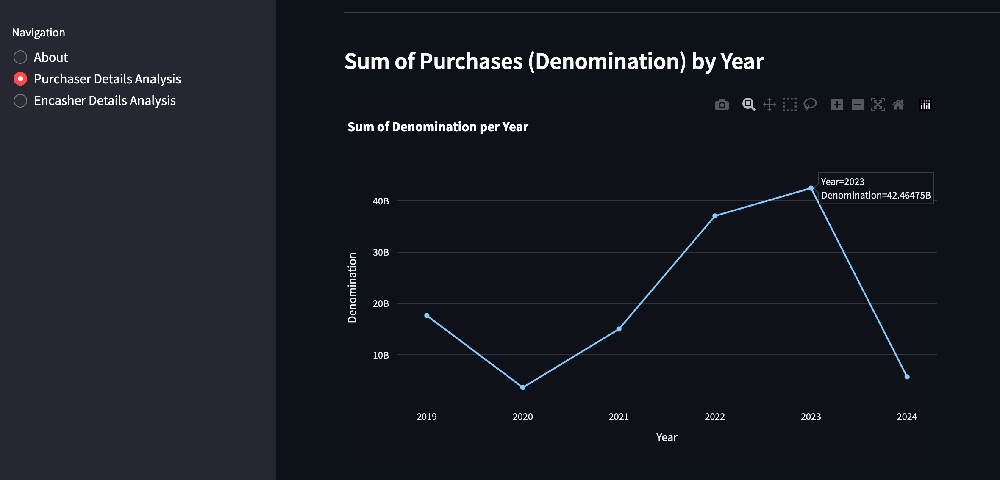
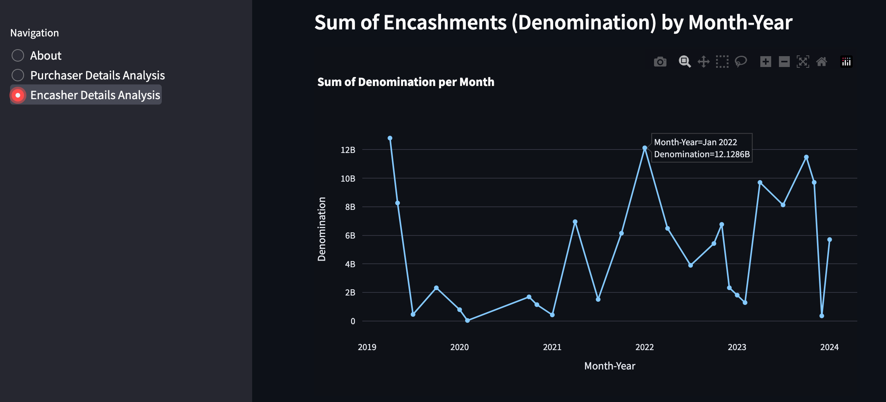

In this project, I use Python to look into electoral bonds. This post shares what I've learned and the code I used.

<!--truncate-->

## Introduction

Electoral bonds are like special coupons used for donating money to political parties in India. The Reserve Bank of India makes these bonds, and anyone or any company in India can buy them. These can then be given to political parties that got at least 1% of votes in the latest elections. The thing is, nobody gets to know who gave the money. These bonds can only be turned into cash by the political party within 15 days through a special bank account.

Recently, India's Supreme Court decided to let everyone know details about these electoral bonds. So, I wanted to look into this data and see what's happening with these donations.

## Data

The data is obtained from the [Election Commision of India](https://www.eci.gov.in/disclosure-of-electoral-bonds) website. The data is available in the form of PDFs.

## PDF to CSV challenge

Because the data was in PDFs, which are hard to work with, I used Python [PyPDF2](https://pypdf2.readthedocs.io/en/3.0.0/) to change it into CSV files, which are easier to handle. Here's a picture showing how I did it:

|  |
| -------------------------------------------------- |

## Data Analysis

I looked into details about who bought the bonds and who cashed them in. You can find all the code and how to set it up on my [GitHub repository](https://github.com/utk09/electoral-bonds-data-analysis/blob/main/README.md)

## Screenshots of the visualizations

|  |
| ----------------------------------------------------------------------- |

|  |
| ----------------------------------------------------------------------- |

|  |
| ----------------------------------------------------------------------- |

|  |
| -------------------------------------------------------------------- |

|  |
| -------------------------------------------------------------------- |

## Hosted Application

I made a Streamlit app where you can interact with the data: [https://electoral-bonds-data-analysis.streamlit.app/](https://electoral-bonds-data-analysis.streamlit.app/)

## Conclusion

Working on this project was a big learning experience. I got to know more about electoral bonds and how to handle PDFs. The project is still ongoing, and I plan to add more features. If you have any ideas or comments, feel free to contact me on [Twitter](https://twitter.com/utk09) or open an issue on [GitHub](https://github.com/utk09/electoral-bonds-data-analysis/issues).
