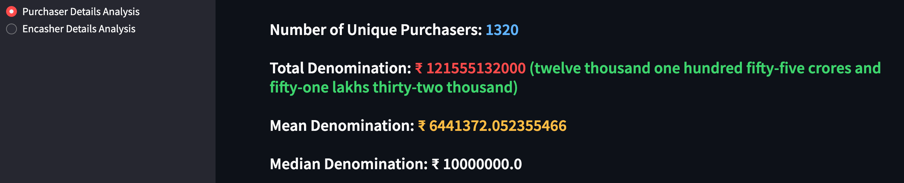
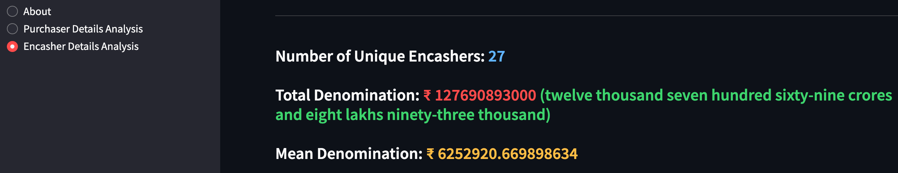

In this project, I use Python to look into electoral bonds. This post shares what I've learned and the code I used.

<!--truncate-->

## Introduction

Electoral bonds are like special coupons used for donating money to political parties in India. The Reserve Bank of India makes these bonds, and anyone or any company in India can buy them. These can then be given to political parties that got at least 1% of votes in the latest elections. The thing is, nobody gets to know who gave the money. These bonds can only be turned into cash by the political party within 15 days through a special bank account.

Recently, India's Supreme Court decided to let everyone know details about these electoral bonds. So, I wanted to look into this data and see what's happening with these donations.

## Data

The data is obtained from the [Election Commision of India](https://www.eci.gov.in/disclosure-of-electoral-bonds) website. The data is available in the form of PDFs.

## PDF to CSV challenge

Because the data was in PDFs, which are hard to work with, I used Python [PyPDF2](https://pypdf2.readthedocs.io/en/3.0.0/) to change it into CSV files, which are easier to handle. Here's a screenshot of code showing how I did it:

|  |
| -------------------------------------------------- |

In this project, the main task was to sort out data from electoral bonds that were all mixed up without clear separation between different pieces of information. The data didn't have usual separators like commas or new lines to tell where one piece of data ended and the next one began.

The solution came from noticing patterns in the data: it started with `dates` and ended with money amounts (like 1,000, 10,000, 1,00,000), which always had `000` at the end. Here's how the sorting was done:

1. **Extracting Text:** First, the text was taken out and put into a list. This text was usually one record for each page of the PDF.

2. **Finding Dates:** Then, using patterns, the script found where each date started in the text. Since all records started with a date, this helped identify the beginning of each new piece of data.

3. **Cutting into Pieces:** With the start of each date found, the text was cut into sections. Each section was supposed to be one record.

4. **Pulling Out Information:** For every piece of text, the script looked for and pulled out important information like the date, how much money was involved, and who was involved.

5. **Cleaning Up:** After getting the necessary details, the script removed any unwanted bits from the money amounts and made sure everything looked right.

6. **Putting Everything Together:** All cleaned data for each record was put together in a structured way, making it ready for the last step.

7. **Making a CSV File:** In the end, all these structured records were turned into a CSV file, which is much easier to work with for analysis.

You can find the complete scripts for this process [here](https://github.com/utk09/electoral-bonds-data-analysis/blob/main/01_clean_purchaser_data.py) for the purchaser data and [here](https://github.com/utk09/electoral-bonds-data-analysis/blob/main/02_clean_encasher_data.py) for the encasher data.

This method made it possible to turn messy text into neat, ordered data ready for digging into.

## Data Analysis

I looked into details about who bought the bonds and who cashed them in. You can find all the code and how to set it up on my [GitHub repository](https://github.com/utk09/electoral-bonds-data-analysis/blob/main/README.md)

In this analysis, I focussed on the purchase and encashment patterns of Electoral Bonds. Here are the main areas explored:

- **Number of Unique Participants:** Calculated the total number of distinct purchasers and encashers to understand the diversity in participation.
- **Total Transaction Amounts:** Summed up the total money involved in all transactions to gauge the scale of electoral bonds dealings.
- **Statistical Measures:** Examined the average (mean), median, and various quantiles (25th, 50th, and 75th percentiles) of the transaction amounts to understand the distribution and central tendencies.
- **Purchaser Summaries:** Grouped the total purchases by each purchaser along with their respective purchasing dates, providing insights into the most active participants.
- **Yearly and Monthly Analyses:** Created plots to visualize how the total purchase amounts varied across different years and months, offering a temporal perspective on the data.
- **Interactive Visualizations:** Utilized Plotly to generate interactive charts, enabling a dynamic exploration of how different purchasers behaved over time.
- **Encasher Summaries:** Similar to purchasers, I analyzed the total encashments by each political party and included the dates of encashment, highlighting the primary beneficiaries.
- **Encashment Trends:** Illustrated through plots how the total amounts encashed fluctuated across years and months, shedding light on the temporal patterns from the encashers' perspective.

The approach employed for this analysis utilizes Python and libraries like Pandas, Streamlit, and Plotly to process, analyze, and visualize the data. Streamlit was chosen for its ability to quickly create interactive web apps, allowing for a more engaging presentation of the findings. Plotly, on the other hand, adds an interactive dimension to the data visualizations, making the exploration of trends more intuitive.

## Screenshots of the visualizations

|  |
| ----------------------------------------------------------------------- |

|  |
| ----------------------------------------------------------------------- |

|  |
| ----------------------------------------------------------------------- |

|  |
| -------------------------------------------------------------------- |

|  |
| -------------------------------------------------------------------- |

## Hosted Application

I made a Streamlit app where you can interact with the data: [https://electoral-bonds-data-analysis.streamlit.app/](https://electoral-bonds-data-analysis.streamlit.app/)

## Conclusion

Working on this project was a big learning experience. I got to know more about electoral bonds and how to handle PDFs. The project is still ongoing, and I plan to add more features. If you have any ideas or comments, feel free to contact me on [Twitter](https://twitter.com/utk09) or open an issue on [GitHub](https://github.com/utk09/electoral-bonds-data-analysis/issues).
