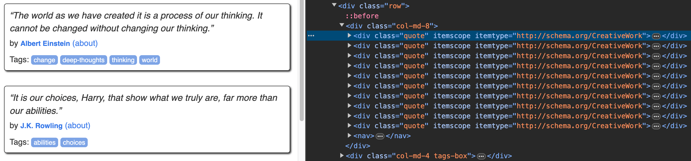
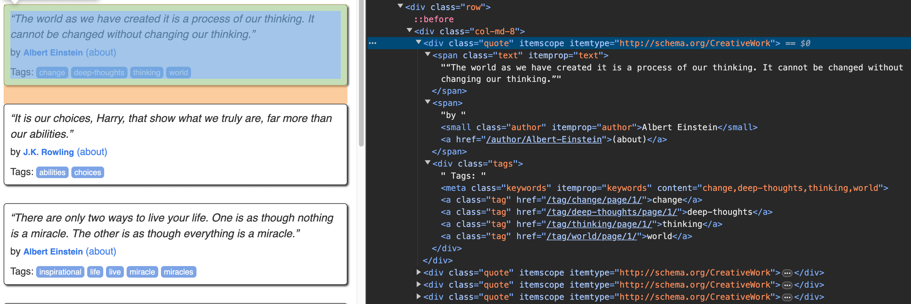

In this series, we'll explore the steps in a data science project, starting with data acquisition.

## Introduction

Data is essential for any data science project. It underpins analysis and model building. Common data acquisition methods include:

1. **Web Scraping**: This is the process of extracting data from websites. We can use libraries like `requests` and `beautifulsoup` in Python to scrape data from websites.
2. **APIs**: Many websites provide APIs to access their data. We can use these APIs to get the data we need.
3. **Databases**: We can also get data from databases. There are many public databases available on the internet that we can use for our projects.

We'll focus on web scraping first.

## Libraries

Web scraping involves extracting data from websites. Python offers several libraries for this:

- [requests](https://docs.python-requests.org/en/master/): A simple library for making HTTP requests.
- [httpx](https://www.python-httpx.org/): A library for making HTTP requests.
- [urllib3](https://urllib3.readthedocs.io/en/latest/): A powerful library for making HTTP requests.
- [beautifulsoup](https://beautiful-soup-4.readthedocs.io/en/latest/): Parses HTML to retrieve necessary data.
- [scrapy](https://scrapy.org/): A comprehensive tool offering extensive web scraping capabilities.
- [selenuim](https://selenium-python.readthedocs.io/): Automates web browsers for data extraction.
- [playwright](https://playwright.dev/python/docs/intro): A newer option offering a straightforward approach to web scraping.
- [MechanicalSoup](https://mechanicalsoup.readthedocs.io/en/stable/index.html): Automates web browser interactions for data retrieval.
- [lxml](https://lxml.de/): A library for processing XML and HTML documents.

## Scraping Data

In this section, we'll learn how to extract data from [**quotes.toscrape.com**](https://quotes.toscrape.com/) using Python's `requests` and `BeautifulSoup` libraries.

### Setting Up Your Environment

First, ensure you have [**Python**](https://wiki.python.org/moin/BeginnersGuide/Download) installed. Then, set up a virtual environment using [**venv**](https://docs.python.org/3/library/venv.html) _(which is included in Python 3.3 and later)_ to install the required libraries.

```bash
# Create a virtual environment
$> python -m venv data_science_env

# Activate the virtual environment

# On Windows, use:
$> data_science_env\Scripts\activate

# On Unix or MacOS, use:
$> source data_science_env/bin/activate

# Install required libraries
$> pip install requests beautifulsoup4
```

If you prefer not to install anything on your local machine, [**Replit**](https://replit.com/) is a convenient alternative. It's an online IDE that supports Python without needing any local setup.

### Scrape the Data

Now, let's proceed to the actual scraping. We aim to collect quotes, authors, and tags from the site and save them into a CSV file for further analysis or use.

Here’s a simplified explanation of the process:

- **Request Website Data**: We use `requests` to download the page content.
- **Parse HTML Content**: With `BeautifulSoup`, we sift through the HTML to find the data we're interested in.
- **Extract and Save Data**: We pull out the required information and write it to a CSV file.

This method offers a practical approach to gather data from the web efficiently and ethically. Ensure to respect the website's `robots.txt` rules and terms of service when scraping. In our case, the website we're scraping is designed for practice and learning purposes.

### Code

```python
# Filename: quotes_scraper.py

# Import necessary libraries
import requests  # Used for making HTTP requests.
from bs4 import BeautifulSoup  # Used for parsing HTML content.
import csv  # Used for handling CSV file operations.
import time  # Used for introducing delays during execution.

# The base URL for the quotes to scrape.
base_url = 'https://quotes.toscrape.com'

# Flag to check if any quotes have been found across pages.
quotes_found = False

# CSV file name to store the scraped data.
csv_file = "quotes.csv"

# Open a new CSV file to store scraped data, ensuring it uses UTF-8 encoding.
with open(csv_file, "w", newline='', encoding='utf-8') as file:
    writer = csv.writer(file)  # Create a CSV writer object.
    writer.writerow(["Quote", "Author", "Tags"])  # Write the header row for the CSV file.

# Loop through pages 1 to 10 of the website.
# From https://quotes.toscrape.com/page/1/ ... https://quotes.toscrape.com/page/10/
for page_num in range(1, 11):
    # Construct the URL for the current page by appending the page number.
    url = f"{base_url}/page/{page_num}/"
    # Make a GET request to the constructed URL.
    response = requests.get(url)
    # Parse the HTML content of the page using BeautifulSoup.
    soup = BeautifulSoup(response.text, 'html.parser')

    """
      As seen in the HTML structure of the website (ref Image 1),
      each quote is contained within a <div class="quote"...> element.
    """

    # Find all elements with the class "quote", which contain the desired information.
    quoteAuthorTags = soup.find_all(class_="quote")
    # The find_all method returns a list of all matching elements.

    # Check if the list of found quote elements is empty.
    if not quoteAuthorTags:
        # Print a message indicating no quotes were found on this page.
        print(f"No quotes found on page {page_num}.")
    else:
        # If quotes are found, set the flag to True.
        quotes_found = True

        """
          As seen in the HTML structure of the website (ref Image 2),
          each quote block contains the <span class="text"...>,
          <small class="author"...>, and <a class="tag"...> elements.
          We extract the quote text, author, and tags from each quote block.
        """

        # Iterate over each quote block found on the current page.
        for eachQuoteAuthorTag in quoteAuthorTags:
            # Extract and clean the quote text.
            quote = eachQuoteAuthorTag.find(class_="text").get_text(strip=True).replace('“', '').replace('”', '')
            # (strip=True) removes leading and trailing whitespaces
            # (replace('“', '').replace('”', '')) removes the opening and closing quotes

            # Extract the author's name, stripping leading and trailing whitespace.
            author = eachQuoteAuthorTag.find(class_="author").get_text(strip=True)
            # Extract all tags associated with the quote and join them as a single string.
            tags = ', '.join([tag.get_text(strip=True) for tag in eachQuoteAuthorTag.find_all('a', class_='tag')])

            # Append the extracted data to the CSV file.
            with open(csv_file, "a", newline='', encoding='utf-8') as file:
                writer = csv.writer(file)  # Create a CSV writer object.
                writer.writerow([quote, author, tags])  # Write the extracted data as a row in the CSV file.

        # Print a message indicating successful scraping of the current page.
        print(f"Page {page_num} scraped successfully.")
    # Pause the loop for 2 seconds to avoid overwhelming the server.
    time.sleep(2)

# After finishing all pages, check if any quotes were found.
if not quotes_found:
    # If no quotes were found, print a message indicating that.
    print("No quotes were found on any of the pages.")
else:
    # If quotes were found, print a completion message.
    print("Scraping completed successfully.")

# Check if quotes were found before trying to read the file.
if quotes_found:
    # Print a message indicating that the script will display the first 5 rows from csv_file.
    print(f"Displaying the first 5 rows from {csv_file}:")
    # Open the csv_file file in read mode.
    with open(csv_file, 'r', encoding='utf-8') as file:
        reader = csv.reader(file)  # Create a CSV reader object.
        # Iterate through the first 5 rows of the CSV file.
        for i, row in enumerate(reader):
            if i >= 5: break  # Stop after printing 5 lines.
            print(row)  # Print each row.
```

Image 1: Each quote contains a `div` with the class `quote`
|  |
|----------------------------------------------------|

Image 2: Each quote block contains the `text`, `author`, and `tag`
|  |
|------------------------------------------------------------------------------------|

### Running the Script

To run the script, save it to a file (e.g., `quotes_scraper.py`) and execute it using the command:

```bash
$> python quotes_scraper.py
```

On Replit, you can simply click the **"Run"** button if you've added this code in `main.py`

### Output

After running the script, you should see a message indicating that the scraping was successful. The script will also display the first 5 rows from the CSV file.

```plaintext
Page 1 scraped successfully.
Page 2 scraped successfully.
... (output for pages 3 to 9)
Page 10 scraped successfully.
Scraping completed successfully.
Displaying the first 5 rows from quotes.csv:
['Quote', 'Author', 'Tags']
['The world as we have created it is a process of our thinking. It cannot be changed without changing our thinking.', 'Albert Einstein', 'change, deep-thoughts, thinking, world']
['It is our choices, Harry, that show what we truly are, far more than our abilities.', 'J.K. Rowling', 'abilities, choices']
['There are only two ways to live your life. One is as though nothing is a miracle. The other is as though everything is a miracle.', 'Albert Einstein', 'inspirational, life, live, miracle, miracles']
['The person, be it gentleman or lady, who has not pleasure in a good novel, must be intolerably stupid.', 'Jane Austen', 'aliteracy, books, classic, humor']
```

## Conclusion

We've covered the basics of web scraping with Python and discussed ethical considerations. Next, we'll look into how to analyse the data we've gathered.
